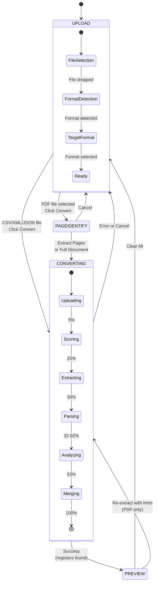
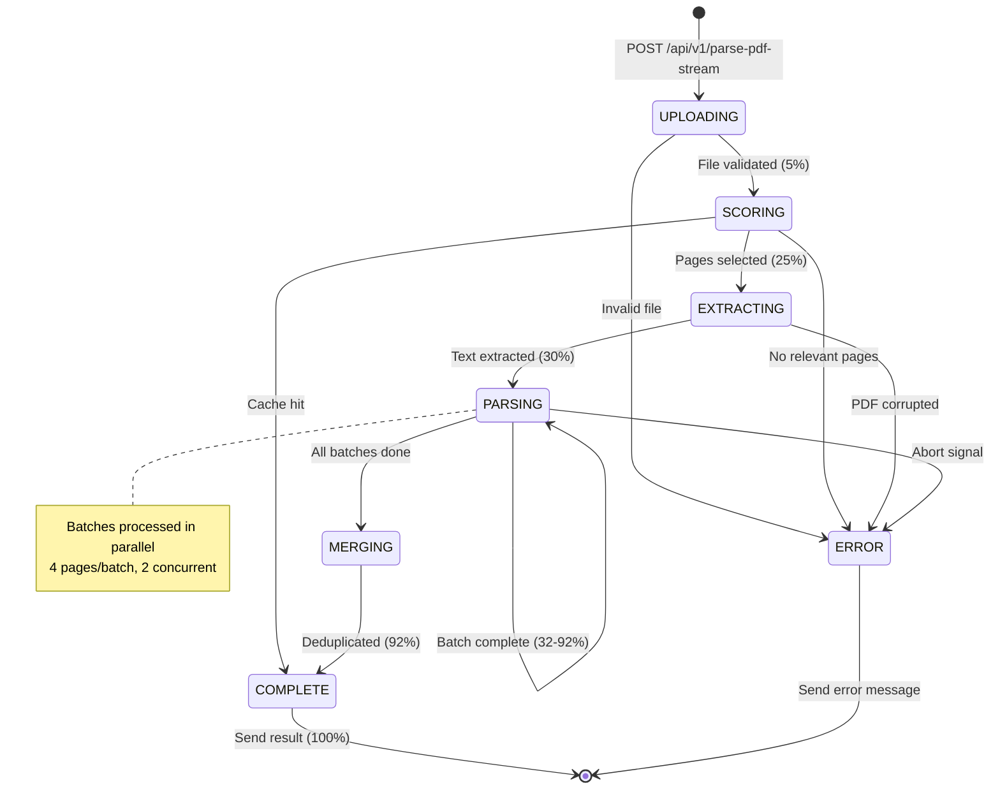
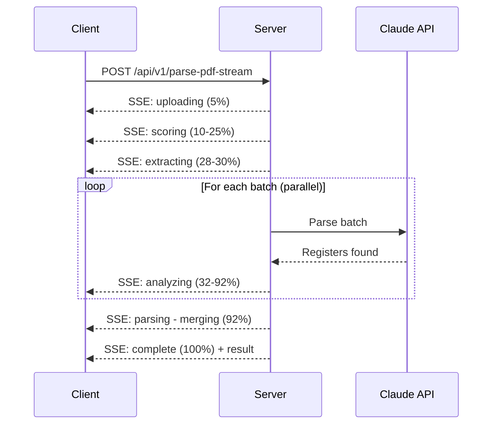

# ModMapper State Machine

This document describes the execution flow of the ModMapper application using state machine diagrams.

## Overview

ModMapper is a Modbus Document Converter with two main state machines:
1. **Client-Side Workflow** - User interface states (React)
2. **Server-Side Processing** - PDF parsing pipeline (Express + Claude API)

---

## Client-Side Workflow

The application has 4 main workflow states that guide the user through the conversion process.

### State Descriptions

| State | Components | User Actions |
|-------|------------|--------------|
| **UPLOAD** | UploadZone, FormatSelector, ConversionControls | Select file, choose target format, click Convert |
| **PAGEIDENTIFY** | PageIdentifier, PdfViewer | View PDF pages, select page ranges, extract |
| **CONVERTING** | AnimatedProgress, WorkflowStepper | View progress, cancel if needed |
| **PREVIEW** | RegisterTable, PreviewPanel, DownloadSection | Edit registers, preview output, download |

### Transition Triggers

| From | To | Trigger |
|------|-----|---------|
| UPLOAD | PAGEIDENTIFY | PDF file + Convert button |
| UPLOAD | CONVERTING | Non-PDF file + Convert button |
| PAGEIDENTIFY | UPLOAD | Cancel button |
| PAGEIDENTIFY | CONVERTING | Extract Pages / Full Document |
| CONVERTING | PREVIEW | Processing success |
| CONVERTING | UPLOAD | Error or Cancel |
| PREVIEW | UPLOAD | Clear All button |
| PREVIEW | CONVERTING | Re-extract with hints (PDF) |

---

## Server-Side Processing Pipeline

The PDF parsing uses a multi-pass pipeline with Server-Sent Events (SSE) for real-time progress updates.

### Processing Stages

| Stage | Progress | Description |
|-------|----------|-------------|
| **UPLOADING** | 5-10% | Validate file, setup SSE connection |
| **SCORING** | 10-25% | Score pages for relevance, extract document hints |
| **EXTRACTING** | 28-30% | Extract text from relevant pages only |
| **PARSING** | 32-92% | Send batches to Claude API in parallel |
| **MERGING** | 92% | Deduplicate and merge register results |
| **COMPLETE** | 100% | Return results, close connection |
| **ERROR** | 0% | Return error message, close connection |

### SSE Progress Events

### Error Recovery

| Error Condition | Stage | Recovery |
|-----------------|-------|----------|
| Invalid file | UPLOADING | Return 400, client shows error |
| No relevant pages | SCORING | Return error via SSE |
| PDF corrupted | EXTRACTING | Return error via SSE |
| Batch fails | PARSING | Continue with partial results |
| Abort signal | Any | Return "Processing cancelled" |
| Timeout (5 min) | Any | Connection closed |

---

## Key Source Files

| Component | File |
|-----------|------|
| Client workflow state | `client/src/pages/home.tsx` |
| Processing state reducer | `client/src/hooks/use-pdf-processing.ts` |
| PDF parsing pipeline | `server/pdf-parser/index.ts` |
| SSE routes | `server/routes.ts` |
| Progress types | `server/pdf-parser/types.ts` |

---

## Configuration

| Setting | Default | Environment Variable |
|---------|---------|---------------------|
| Pages per batch | 4 | `PAGES_PER_BATCH` |
| Parallel batches | 2 | `PDF_PARALLEL_BATCHES` |
| SSE timeout | 5 min | `DEFAULT_SSE_TIMEOUT_MS` |
| Cache TTL | 30 min | `PDF_CACHE_TTL_MINUTES` |
